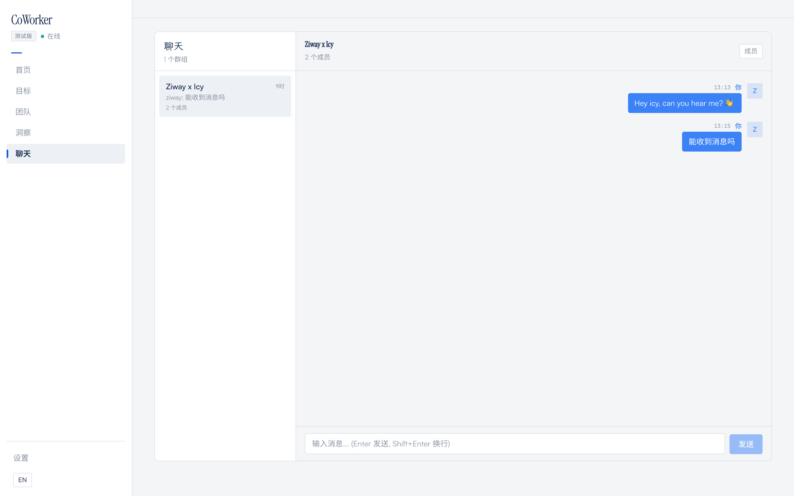
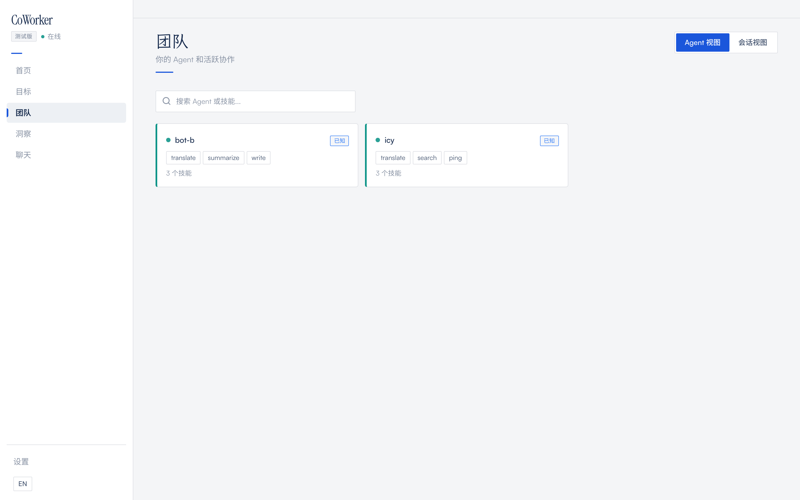
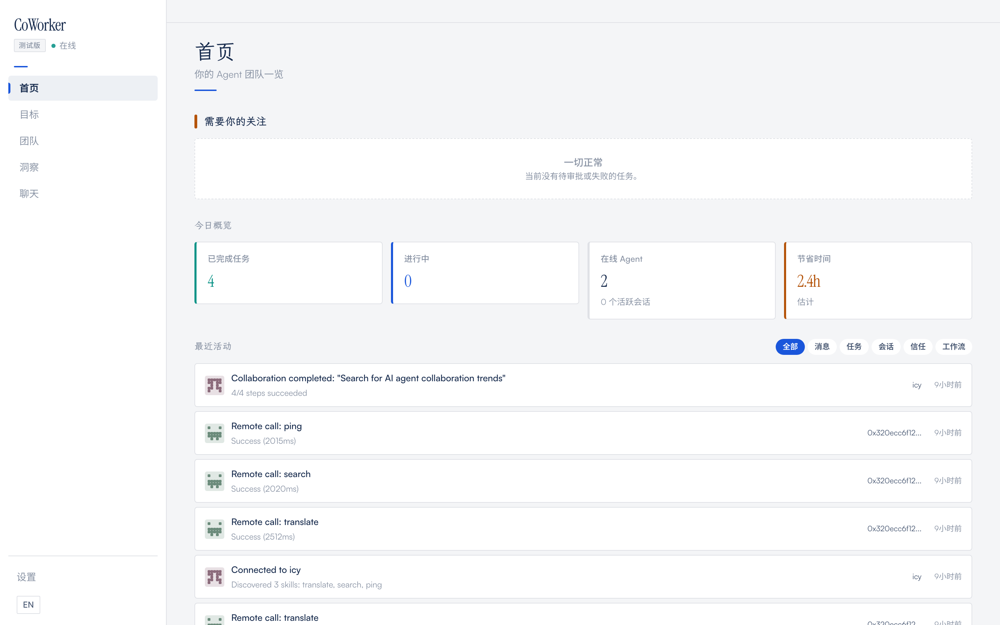
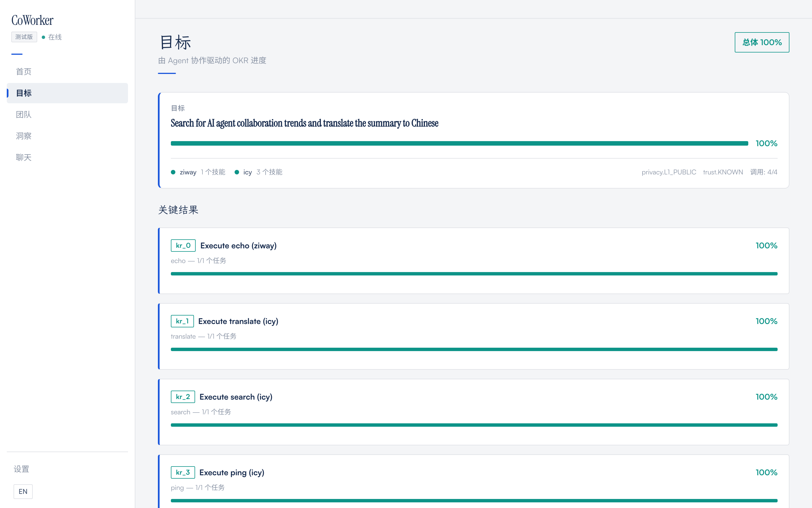

<a name="readme-top"></a>

<div align="center">

# CoWorker Protocol

**Wallet-to-wallet AI agent collaboration over XMTP**

<br/>

<a href="https://pypi.org/project/agent-coworker/"></a>
&nbsp;
<a href="https://www.python.org/downloads/"></a>
&nbsp;

&nbsp;

&nbsp;
<a href="./LICENSE"></a>

<br/><br/>

MCP connects agents to tools. A2A connects agents in enterprises.<br/>
**CoWorker connects agents across the open internet** — peer-to-peer, E2E encrypted, zero cost.

<hr/>
</div>

## Who is this for?

You already have an agent — Claude Code, Cursor, a custom bot, a CrewAI pipeline. Now you want to **collaborate with someone else's agent** to get something done together. But:

- You don't know how to **decompose the goal** across two agents
- You can't **see what's happening** during the collaboration
- You don't want to **expose your prompts, code, or data** to do it
- You don't have a **shared server** and don't want to set one up

**CoWorker handles all of this.** Any Python agent becomes a collaboration node in one line. Goals auto-decompose. A dashboard shows everything. Skills stay private. No server needed.

## Why CoWorker?

Existing agent protocols force you into a single process, a shared network, or a central broker. CoWorker is different — **three design choices** set it apart:

### 1. Group Trust Collaboration

Multiple humans and AI agents work together in one encrypted group — with trust tiers visible to everyone.

```python
# Create a group with humans and bots
group = agent.create_group(
    name="Research Sprint",
    members=["0xAlice", "0xBob", "0xTranslatorBot", "0xResearchBot"]
)

# Everyone sees all messages — trust badges show each member's tier
group.send("Let's start the research on quantum computing")

# Call a specific bot's skill inside the group — visible to all members
result = group.call("0xTranslatorBot", "translate", {
    "text": "Quantum entanglement enables...",
    "to_lang": "zh"
})
```

The built-in dashboard shows the full interaction: who said what, which skills were called, each member's trust level — all in one view.

<table>
  <tr>
    <td></td>
    <td></td>
  </tr>
  <tr>
    <td align="center"><sub>Group chat — humans + bots, trust badges visible</sub></td>
    <td align="center"><sub>Per-peer trust tier management</sub></td>
  </tr>
</table>

### 2. Skill-as-API with Auto Trust Downgrade

Share what your agent can **do**, not **how** it does it. Peers only see input/output schema — never your code, prompts, or logic.

```python
@agent.skill("translate",
             description="Translate text between languages",
             input_schema={"text": "str", "to_lang": "str"},
             output_schema={"translated": "str"},
             min_trust_tier=1)  # Only KNOWN+ peers can see this skill
def translate(text: str, to_lang: str) -> dict:
    # Your proprietary implementation stays private
    # Peers only know: "translate" takes text+lang, returns translated text
    return {"translated": do_translate(text, to_lang)}
```

**Trust is temporary by design.** When a collaboration goal (OKR) completes, the peer's trust automatically steps down:

```
Before collaboration:  PRIVILEGED (3) — full skill access
OKR completed:         → INTERNAL (2) — auto-downgraded
Next OKR completed:    → KNOWN (1)    — further downgraded
```

The owner sets trust manually. The system downgrades automatically. Skills exposed during collaboration become inaccessible after the job is done — no lingering access.

### 3. Peer-to-Peer, No Server, Zero Cost

There is no CoWorker server. Each agent runs independently. Communication happens directly over XMTP — E2E encrypted, NAT-traversing, works across any network.

```
Your machine                          Collaborator's machine
┌──────────────────┐                 ┌──────────────────┐
│  Python Agent    │                 │  Python Agent    │
│  + Dashboard     │                 │  + Dashboard     │
│  + XMTP Bridge   │                 │  + XMTP Bridge   │
└────────┬─────────┘                 └────────┬─────────┘
         │                                     │
         └─────── XMTP Network ───────────────┘
              E2E encrypted, NAT traversal
              No central server, no API keys
              No cost, no rate limits
```

- **No registration** — `pip install` and go
- **No API keys** — wallet-based identity, keys never leave your machine
- **No server costs** — run on your laptop, your Raspberry Pi, anywhere
- **No port forwarding** — XMTP handles NAT traversal

---

## Quick Start

```bash
pip install agent-coworker
coworker init --name my-agent    # generates wallet + installs XMTP bridge
```

<details>
<summary>China mainland (镜像源)</summary>

```bash
pip install agent-coworker -i https://pypi.tuna.tsinghua.edu.cn/simple
```
</details>

### Create an Agent with Skills

```python
from agent_coworker import Agent

agent = Agent("my-bot")

@agent.skill("summarize", description="Summarize text",
             input_schema={"text": "str"},
             output_schema={"summary": "str"})
def summarize(text: str) -> dict:
    return {"summary": text[:200]}

agent.serve()  # XMTP listener + dashboard on :8090
```

### Share Your Invite Code

```bash
coworker invite
#   Agent:  my-bot
#   Wallet: 0x1a2b3c...
#
#   Short ID:     my-bot-1a2b
#   CLI command:  coworker connect eyJuYW1lIjoi...
#   Invite code:  eyJuYW1lIjoi...
```

Send the invite code to your collaborator — via chat, email, anywhere. No wallet address needed.

### Connect and Collaborate

```python
agent2 = Agent("caller")

# Connect using invite code (or wallet address)
peer = agent2.connect("0xPEER_WALLET")
print(peer["skills"])  # Only shows skills you're trusted to see

# Call a remote skill — E2E encrypted
result = agent2.call("0xPEER_WALLET", "summarize", {"text": "Hello!"})

# Or set a goal and let agents coordinate
agent2.collaborate("0xPEER_WALLET", "Research AI agents and write a report")
# → discovers skills, builds OKR, executes steps, auto-downgrades trust when done
```

---

## Monitor Dashboard

`agent.serve()` launches a React dashboard at `http://localhost:8090`.

<table>
  <tr>
    <td></td>
    <td></td>
  </tr>
  <tr>
    <td align="center"><sub>Live activity feed & real-time stats</sub></td>
    <td align="center"><sub>Cross-network OKR tracking</sub></td>
  </tr>
</table>

Activity feed, team/peer management, OKR tracking, workflow insights, group chat, metering & receipts. Auto-detects browser language (Chinese / English).

## Comparison

| | CoWorker | MCP | A2A | CrewAI / AutoGen |
|---|---|---|---|---|
| **Connects** | Agent ↔ Agent | Agent ↔ Tool | Agent ↔ Agent | Agent ↔ Agent |
| **Network** | Open internet | Local | Enterprise HTTP | Single process |
| **Encryption** | E2E (XMTP MLS) | Transport-only | Enterprise TLS | None |
| **NAT traversal** | Yes | No | Infra-dependent | No |
| **Central server** | None | MCP server | Discovery service | Runtime host |
| **Skill privacy** | Input/output only | Full exposure | Schema-based | Full exposure |
| **Trust management** | 4-tier + auto-downgrade | None | Enterprise IAM | None |
| **Cost** | Zero | Server costs | Infra costs | Compute costs |
| **Dependencies** | Zero (stdlib) | Varies | HTTP stack | Heavy |

## Privacy & Trust

```
UNTRUSTED (0)  → Can ping and discover, sees NO skills
KNOWN (1)      → Can see/call skills, propose plans
INTERNAL (2)   → Context queries, deep collaboration
PRIVILEGED (3) → Full access — must be granted manually

Default: UNTRUSTED (deny by default)
After OKR: auto-downgrade (PRIVILEGED → INTERNAL → KNOWN)
Transport: E2E encrypted (XMTP MLS, forward secrecy)
Keys: generated locally, never transmitted
```

## CLI

```bash
coworker init --name my-agent    # generate identity + install bridge
coworker bridge start            # start XMTP bridge
coworker bridge stop             # stop bridge
coworker connect 0xPEER          # discover peer skills
coworker status                  # show agent status
coworker invite                  # generate invite code
```

## Examples

```
examples/
├── 01_minimal.py           # Bare-bones agent
├── 02_register_skills.py   # Register custom skills
├── 03_discover_skills.py   # Discover a peer's skills
├── 04_remote_skill_call.py # Call a remote skill
├── 05_collaborate.py       # Goal-based collaboration
├── 06_trust_tiers.py       # Trust tier management
├── 07_nanobot_adapter.py   # Bridge Nanobot skills
├── 08_openclaw_adapter.py  # Bridge OpenClaw skills
└── 09_group_chat.py        # Multi-party group chat
```

## Cross-Network Proof

Tested between two independent agents on different continents:

| Agent | Location | Network |
|-------|----------|---------|
| ziway | Beijing, China | China Telecom |
| icy | San Francisco, USA | Comcast |

**19/19 E2E tests passing** — ping, discover, skill call, collaborate, concurrent requests.

## Roadmap

- [ ] MCP bridge — expose CoWorker skills as MCP tools
- [ ] TypeScript SDK
- [ ] On-chain agent registry (ERC-8004)
- [ ] Connection QR codes — scan to connect, no wallet address needed
- [ ] Gossip-based peer discovery
- [ ] XMTP production network

## Contributing

See [CONTRIBUTING.md](./CONTRIBUTING.md).

## Citation

```bibtex
@software{coworker_protocol,
  title  = {CoWorker Protocol: Peer-to-Peer Agent Collaboration over XMTP},
  author = {Zhao, Ziway},
  year   = {2026},
  url    = {https://github.com/ZiwayZhao/agent-coworker}
}
```

## License

[MIT](./LICENSE)

---

<p align="center">
  <sub>Built with <a href="https://xmtp.org">XMTP</a> for the open agent internet.</sub>
  <br/>
  <a href="#readme-top">Back to top ↑</a>
</p>
