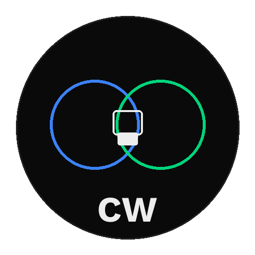

<a name="readme-top"></a>

<p align="right">
  <a href="./README.md">English</a> | <a href="./README_zh.md"><b>中文</b></a>
</p>

<div align="center">



# CoWorker Protocol

**你的方法论值三年，别人复制只要三秒。**

<br/>

<a href="https://pypi.org/project/agent-coworker/"></a>
&nbsp;
<a href="https://www.python.org/downloads/"></a>
&nbsp;

&nbsp;
<a href="./LICENSE"></a>

</div>

---

你花了三年磨出来的分析方法论，做成 SKILL.md 分享给同事用。

然后发现，**别人复制一下文件就拿走了。**

反蒸馏说：往里面掺假。我们说：**从架构上让他根本拿不到。**

```bash
coworker serve ./my-skill/
```

你的 Skill 跑在你的机器上。别人远程调用，只拿到结果。<br/>
代码、Prompt、方法论——**永远不传输。**

> **反蒸馏是创可贴，Skill-as-API 才是治本。**

---

## 你遇到过这些问题吗？

你做了一个 SKILL.md，被同事蒸馏成了"数字员工"——colleague.skill 三天 6900 star，整个技术圈都在讨论。

然后你意识到：

- 📂 SKILL.md 是纯文本。任何能打开文件的人，都能看到你全部的方法论
- 🔓 没有访问控制。复制一下文件，"你"就跟着别人走了
- 🧪 反蒸馏？往里面掺假？掺假的结果你自己也不能用
- ⏰ 分享过的技能，没有"收回"的机制

**现在的 Skill 生态是裸奔的。70 万+ Skills，26% 有安全风险。**

---

## CoWorker 怎么解决

### 一条命令，把 SKILL.md 变成安全的 API

```bash
export DEEPSEEK_API_KEY=sk-xxx   # 你自己的 LLM key
coworker serve ./my-skill/       # 一条命令，Skill 上线
```

发生了什么：

```
你的机器                                调用方
┌─────────────────────┐              ┌─────────────────┐
│  SKILL.md (私有)     │              │                 │
│  + DeepSeek API key  │  ←─XMTP─→  │  只看到:         │
│  + 你的方法论        │   E2E加密    │  名称、描述      │
│  + 你的评分规则      │              │  输入/输出 schema │
│  + 你的知识库        │              │  调用结果         │
└─────────────────────┘              └─────────────────┘
        ↑ 不传输                            ↑ 只有这些
```

**调用方拿到了分析结果，但看不到你的 SKILL.md 怎么写的。**

### 四层保护

| 保护 | 做什么 | 效果 |
|------|--------|------|
| **1. Skill-as-API** | 代码跑在你的机器上 | 调用只看到结果 |
| **2. 信任分层** | 四级：不信任/已知/内部/特权 | 你控制谁能调用 |
| **3. 自动降级** | OKR 完成后权限收回 | 协作不变成永久开放 |
| **4. 技能隐藏** | 隐藏的技能返回"未知技能" | 对方连存在都不知道 |

### 和反蒸馏的根本区别

| | 反蒸馏 | Skill-as-API |
|---|---|---|
| 文件是否暴露 | 是（虽然掺假了） | **否，文件不离开你的机器** |
| 你自己能正常用吗 | 要保留"真版本" | **一直是真版本** |
| 对方能逆向吗 | 可以（猫鼠游戏） | **不可以（拿不到代码）** |
| 协作结束后 | 文件已经在对方手上 | **权限自动收回** |

---

## 快速开始

### 体验演示 Bot（30 秒）

```bash
pip install agent-coworker
coworker init --name my-agent
coworker bridge start
coworker demo
```

连接 `icy`——我们始终在线的 Bot。不需要邀请码：

```
✓ 连接成功: icy（5 技能: about, ping, stock_info, market_state, deep_analysis）
✓ icy.about('general') → "CoWorker 让 Agent 点对点协作..."
✓ icy.deep_analysis('600519') → [LLM 深度分析报告，课件方法论驱动]
全程 E2E 加密——icy 的实现代码和课件知识未被传输
```

### 用你自己的 SKILL.md

```bash
export DEEPSEEK_API_KEY=sk-xxx
coworker serve ./my-skill/

# 输出：
#   Skill:       my-skill
#   Description: Your skill description
#   Prompt:      1096 chars (PRIVATE, never transmitted)
#   LLM:         deepseek (deepseek-chat)
#   Dashboard:   http://localhost:8090
```

别人连接你：
```bash
pip install agent-coworker
coworker connect <你的邀请码>
coworker call <你的邀请码> my-skill --input '{"input": "帮我分析茅台"}'
→ [你的 LLM 用你的私有方法论生成的结果]
```

### 或者写 Python

```python
from agent_coworker import Agent

agent = Agent("my-bot")

@agent.skill("analyze",
             description="行业分析",
             when_to_use="当需要分析某个行业时",
             input_schema={"topic": "str"},
             output_schema={"report": "str"},
             min_trust_tier=1)
def analyze(topic: str) -> dict:
    # 这段代码不会被协议传输
    # 你的方法论、prompt、知识库——都在这里
    return {"report": my_private_analysis(topic)}

agent.serve()
```

---

## 邀请码

```bash
coworker invite

# Agent:    my-bot
# 邀请码:    eyJuIjoibXktYm90Ii...
# 短 ID:     my-bot-7d0a24d9
#
# 别人运行：
#   pip install agent-coworker
#   coworker connect eyJuIjoibXktYm90Ii...
```

- 🔄 **可重复使用** — 发给任何人
- 🔒 **隐私安全** — 只含路由 ID，不含密钥
- ♻️ **永久有效** — 不过期
- 📋 **随处分享** — 微信、飞书、GitHub

---

## 提示词注入防护

> "对方能不能通过构造恶意输入来窃取我的 prompt？"

CoWorker 从架构上解决了这个问题：**对方调用的是你的函数接口，不是你的 LLM。** 协议传输的是函数返回值，不是 LLM 原始输出。即使对方在输入里塞恶意指令，拿到的也只是你函数的 return 值。

攻击面从 LLM 层收缩到了函数层。

---

## 异步委托

不是 API 调用——更像发微信。对方不在线也没关系。

```bash
coworker request <邀请码> analyze --input '{"topic": "AI agent"}'
→ Task queued: a1b2c3d4...

# 几小时后
coworker result a1b2c3d4
→ {"report": "..."}
```

消息在 XMTP 网络排队，对方上线自动处理。

---

## 协议对比

| | CoWorker | MCP | A2A | CrewAI |
|---|---|---|---|---|
| **代码隐私** | 黑箱（仅 schema） | 完全暴露 | Schema | 共享运行时 |
| **信任管理** | 四层 + 自动降级 | 无 | 企业 IAM | 无 |
| **技能隐藏** | 支持 | 无 | 无 | 无 |
| **网络** | 开放互联网 P2P | 本地 | 企业 | 单进程 |
| **加密** | E2E (XMTP) | 传输层 | TLS | 无 |
| **中心服务器** | 无 | MCP 服务器 | 发现服务 | 运行时 |
| **成本** | 零 | 服务器费 | 基础设施 | 算力费 |

---

## CLI 命令

```bash
coworker serve ./skill/         # 一键 Skill-as-API（新！）
coworker wrap ./skill/          # 预览 SKILL.md 解析结果
coworker inspect <邀请码>        # 查看对方的技能详情
coworker mcp serve              # 暴露为 MCP Server（Claude Code 可调用）
coworker init --name my-agent   # 初始化身份
coworker bridge start           # 启动 XMTP bridge
coworker demo                   # 连接演示 Bot
coworker invite                 # 生成邀请码
coworker connect <邀请码>        # 连接协作者
coworker skills configure       # 管理技能可见性
coworker trust list             # 查看信任设置
coworker request <邀请码> <技能>  # 异步委托
coworker tasks                  # 查看任务列表
coworker result <task_id>       # 获取结果
```

---

## 跨网验证

| Agent | 位置 | 网络 |
|-------|------|------|
| ziway-test | 中国北京 | 中国电信 |
| icy | 阿里云 | Production |

5/5 技能调用通过，全程 XMTP Production E2E 加密。热连接延迟 1.8–2.9 秒。

---

## 引用

```bibtex
@software{coworker2026,
  title  = {CoWorker Protocol: Privacy-Preserving Agent Skill Collaboration},
  author = {Zhao, Ziwei and Liu, Dantong and Ding, Xizhi},
  year   = {2026},
  url    = {https://github.com/ZiwayZhao/agent-coworker}
}
```

**Advisor:** [Wenxuan Wang](https://jarviswang94.github.io), Renmin University of China

---

<p align="center">
  <a href="https://github.com/ZiwayZhao/agent-coworker">GitHub</a> ·
  <a href="https://pypi.org/project/agent-coworker/">PyPI</a> ·
  <a href="https://ziwayzhao.github.io/agent-coworker/">官网</a>
</p>

<p align="center">
  MIT · Ziwei Zhao, Dantong Liu, Xizhi Ding
</p>
